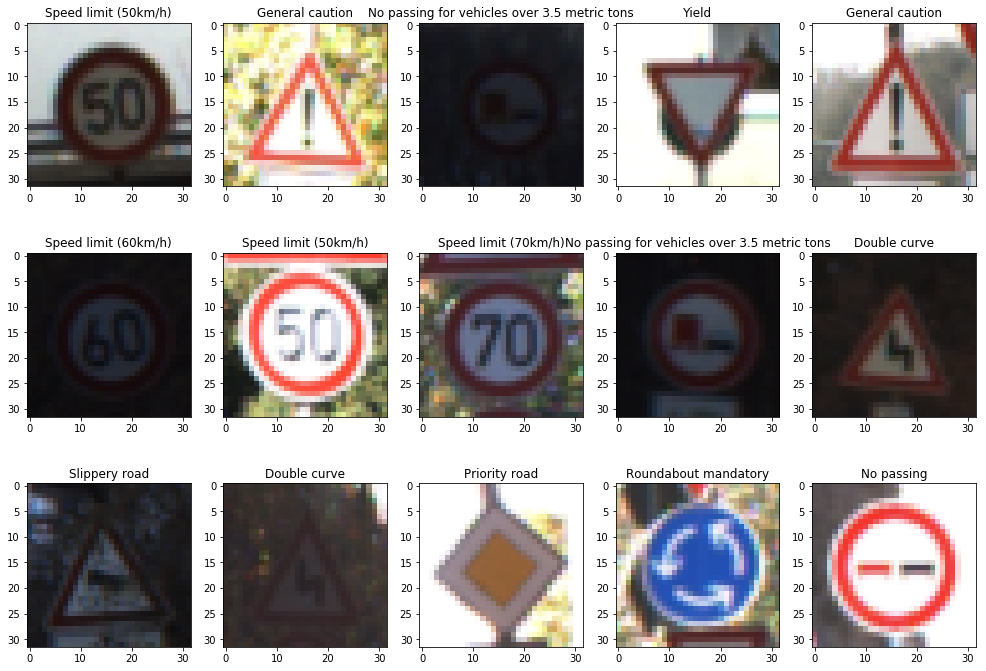
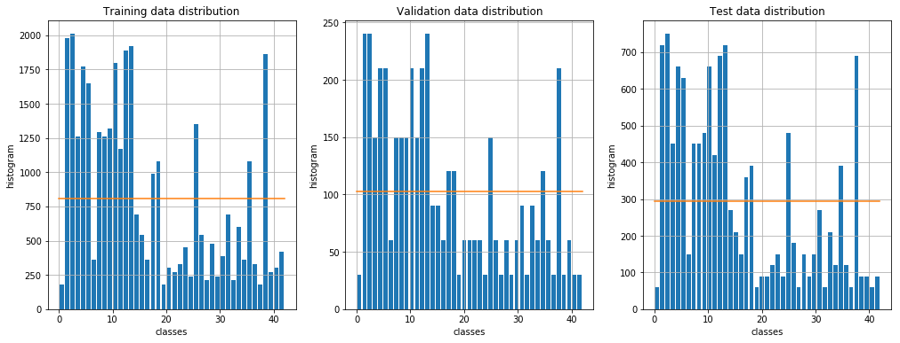
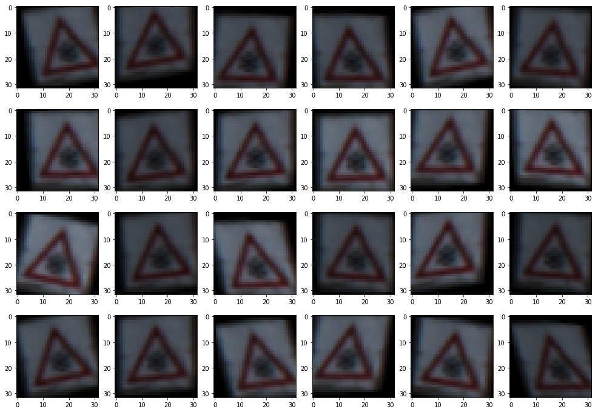
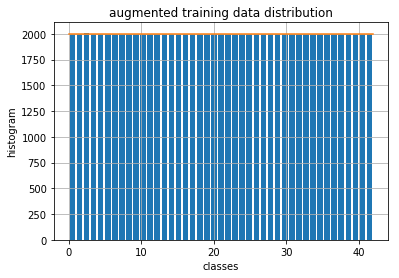
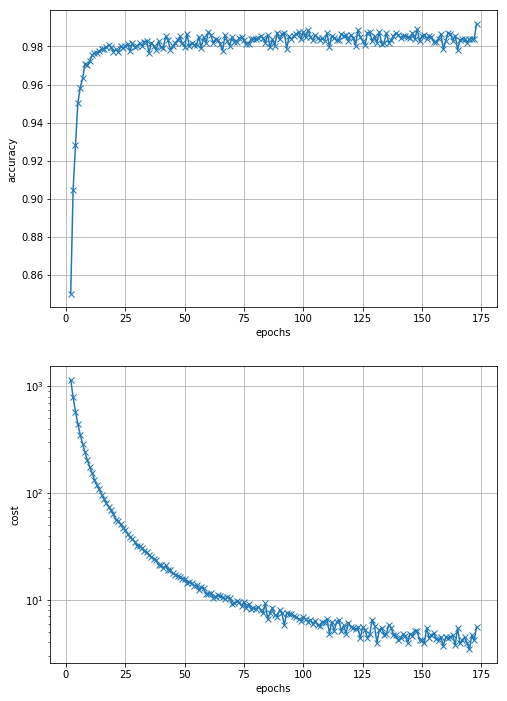
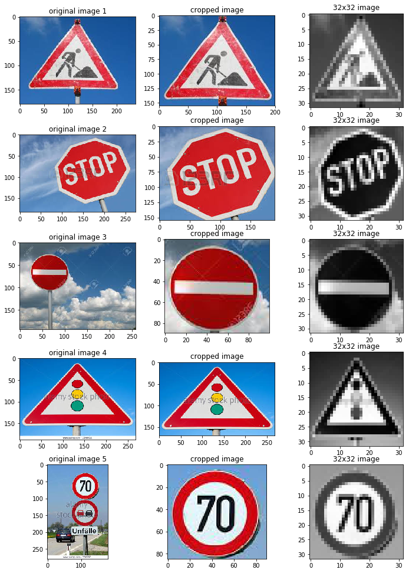

#**Traffic Sign Recognition** 

Ara Patapoutian, July 2, 2017

---

**Build a Traffic Sign Recognition Project**

The goals / steps of this project are the following:
* Load the data set (see below for links to the project data set)
* Explore, summarize and visualize the data set
* Design, train and test a model architecture
* Use the model to make predictions on new images
* Analyze the softmax probabilities of the new images
* Summarize the results with a written report

## Rubric Points
###Here I will consider the [rubric points](https://review.udacity.com/#!/rubrics/481/view) individually and describe how I addressed each point in my implementation.  

---
###Writeup / README

###Data Set Summary & Exploration

####1. Basic summary of the data set

I calculated the Data set sizes to be as follows:

- Number of training examples    = 34799
- Number of validation examples = 4410
- Number of testing examples       = 12630
- Image data shape                          = (32, 32, 3)
- Number of classes                         = 43  (used np.unique() function to get this)

see cell 3, for details

####2. Exploratory visualization of the dataset.

1. Here is 15 randomly selected images. 
   - Using file signames.scv, I mapped class number to class description on the titles (see cell 4)

2. To better understand data distribution amongst the classes, below is the histogram of the classes for all three data sets: training, validating and testing, (see cell 5)
   - I was surprised to see the large variation in frequency of occurrence between different classes
   - As an example, in the training data, class-label 0 ()"Speed limit (20km/h)"), occurs only 180 times whereas the mean value of samples per class is 809!
   - This is a concern, and as a consequence I will augment the data set by augmentation, see below

###Design and Test a Model Architecture

### Preprocessing 

I investigated **three** options for data preprocessing:

1. **Data Augmentation**

2. **Color versus grayscale**

3. **Normalize pixels versus not**

   ### Data Augmentation 

   - As described above, in the original data set there are certain classes with limited occurrences
   - Added the capability (see cell 11) that adds images to each class till minimum count is satisfied
     - AUGMENT_FLAG   = True   #if True augments otherwise does not
     - MIN_CLASS_SIZE = 2000   # every class will have at least MIN)CLASS_SIZE samples

   - The dataset was expanded by having the following transformations on each image (cell 7):
     - Translation (x and y independently)
     - Rotation (from center)
     - Shear (x and y independently)
     - Color saturation level 

     see cells7, 8 and 10 

   - I used cv2 module for preparing images, see cell 7 for specific usage

        - I used cv2.warpAffine() function to make the geometric transformations (translation, rotation and shear) 
        - I used HSV color format to control saturation

   - I control the the transformation hyperparameters in cell 10

     - MAX_SHIFT       = 0                          # max translation allowed
       MAX_SHEAR     = 0.15                    # max shear ratio allowed
       MAX_ANGLE    = 0                          # max angle in degrees allowed
       MIN_SAT          = 0.5                       # max attenuation of saturation

        - Using these hyperparameters plotted 15 random transformations, see images below

          

   - After augmentation, the class distribution looks like this:

     

     and the training sample size increased from 34799 to 86010 (one class has 2010 samples, all others have 2000 samples)

     ### Color and Pixel Normalization

- Color:

  - Color has more information but also requires 3 times more input
  - Since the network should not be sensitive to light shades, etc. the additional information of color may not be that useful 

- Pixel normalization

  - For normalization, I considered what the suggested transformation

    $x_\text{norm}= \frac{x-128}{128}$

  which makes the mean=0 and $x_\text{norm} \in [-1,1]$

- I ran $2 \times 2 = 4$ configurations to investigate both color and & pixel normalization the as described by the first two  columns in the table below. The last column is the accuracy result (before final run)

| Color     | normalize | validation accuracy |
| --------- | --------- | :-----------------: |
| RGB       | no        |        0.960        |
| RGB       | yes       |        0.973        |
| grayscale | no        |        0.985        |
| grayscale | yes       |        .976         |

- Since grayscale and no normalization gave best results I chose **Gray-scale** and **no normalization**   

* Wrote the code so that I control these four modes by two hyperparameters, and without changing source codes
  * USE_GRAYSCALE = True        
  * USE_NORM          = False 
* I was surprised that normalization did not help
  * I realize there is some variation from one training to the next due to initialization, so the validation accuracy is not very reliable
* I had to use a smaller learning rate with non scaled pixel option

####2. Model architecture

- **The initial  architecture was LeNet**
  - LeNet was chosen since 
    - it was already available and 
    - was used to classify numbers which is not that different than traffic signs
  - However, LeNet did not have enough depth (feature sizes) and enough FC units to recognize 43 classes
  - Even given LeNet,  a lot of parameters should to be optimized
  - My philosophy is chose the simplest or least complex network, without losing validation accuracy
    - By doing that I am trying not to overfit the network 

- **Conv layers**
  - Tried 3 conv layers but did not see validation accuracy improvement
  - I used 2-to-1 ratio between features of 2nd layer versus 1st, to limit exponential growth of possibilities
  - Increased layer features (depth) up to  (layer-1=64, layer-2=128) , observing better validation accuracy
    - However, when I increased the features  (100, 200) did not see additional improvement. 
    - decided to stop at (64, 128)
  - Since conv layers use few trainable parameters, I did not try to reduce kernel size and stayed with the initial setup of (5x5)
- **Fully connected layers**
  - Tried 2 layers versus single layer, did not see improvement of 2-layers over 1-layer
  - Increased layer units up to  128 units with better validation accuracy. However, when I tried  200 did not see additional improvement 
  - Ended up using a single layer FC with 128 units
- **Activation function** 
  - Tried five different activation functions:
    - tf.nn.tanh
    - tf.nn.relu
    - tf.nn.elu
    - tf.nn.sigmoid
    - tf.nn.softplus
  - tanh() was the clear winner 

- **I controlled these choices using the following parameters (see cell 15):**
  - FEATURES               = (64, 128)  #features (or depth) for conv layers 1 and 2 respectively
  - CONV_KERNEL      = (5, 5)     # for conv layers 1 and 2 respectively
  - POOL_STRIDES      = (2, 2)     #pool kernel and strides for layers 1 and 2 respectively
  - FC_DIM                    = 128        #units in fully connected layer
  - ACTIVATION_MODE= 0          #0=tanh, 1=relu, 2=elu, 3=sigmoid, 4=softmax

- **My final network consisted of the following layers ans parameters:**

|     Layer      | Description                       | input             | output            |
| :------------: | :-------------------------------- | ----------------- | ----------------- |
| Conv-, tanh()  | kernel=(5,5,1,64),  VALID padding | ( 32 x 32 x   1)  | ( 28 x  28 x  64) |
|  Max pooling   | kernel = (2 x 2)                  | ( 28 x  28 x  64) | ( 14 x  14 x  64) |
| Conv-2, tanh() | kernel=(5,5,1,64), VALID padding  | ( 14 x  14 x  64) | ( 10 x  10 x 128) |
|  Max pooling   | kernel = (2 x 2)                  | ( 10 x  10 x 128) | (  5 x   5 x 128) |
|   FC, tanh()   | -                                 | 3200              | 128               |
|     Logits     | fully connected, softmax          | 128               | 43                |

The trainable parameters in this network is **623,300** (see cell 18)

layer-1 trainable parameters =   1,625
layer-2 trainable parameters = 206,400
layer-3 trainable parameters = 409,728
layer-4 trainable parameters =   5547
total   trainable parameters = 623,300

####3. Model Training

- My hyperparameters are listed in  cell 16
  - MAX_EPOCHS    = 200         # max training iterations, if needed
  - ACCURACY_GOAL = 0.99  # stop training if either MAX_EPOCHS or ACCURACY_GOAL is achieved
  - BATCH_SIZE    = 128             # mini-batch size
  - L_RATE        = 0.00008         # learning rate	
  - W_STD         = 0.04               # std for weight initialization
  - KEEP_PROB     = 0.3		#dropout

- Note that I stopped my training as soon as I hit 0.99 or above
- BATCH_SIZE=128 allowed me get better accuracy results compared to 256 or above
- BATCH_SIZE=128 allowed me to use smaller L_RATE ( I stayed with adam optimizer)
- Optimized weights (W_STD) by running training for 1 EPOCH and observing for what value I get highest accuracy
- To minimize overfitting, I used dropout 
  - Used dropout both for conv-2 & FC layers, 
    - did not see improvement at conv-2 layer
    - decided to use only on FC
  - Again, my philosophy was to choose KEEP_PROB to be as small as possible (to prevent ooverfitting) without impacting accuracy, 
    - 0.1 was too slow and showed sign of under fitting, 
    - but 0.3 gave good results and I chose that
    - 0.5 did not give better results than 0.3
    - ​

####4. Solution Approach

- My approach was to play with various parameters and observe

  1. Training cost (what the network sees)
  2. Validation accuracy (whats the user sees)

If training cost-function got smaller while accuracy stayed the same, or got worst, that implied to me I was overfitting, see plot below for an example of cost versus validity-accuracy:

- My final model results were:
  - training cost of 5.6 (not normalized, this is a relative cost number and not very meaningful by itself)
  - validation accuracy of **99.2%**, see cell 20
- test set accuracy of **97.3%** (tested once at the end)

Disappointed that despite all the measures I took to minimize overfitting, the test data was 1.9% inferior than the validation data

###Test a Model on New Images

####1. Acquiring New Images 

I found five German traffic signs on the web, cropped them and converted them to grayscale as can be seen below, see cell 23

I was interested to see how image 5 (70 km per hr) would behave, since there are other classes (classes 0 to 5) with speed limits enclosed in circles.  Furthermore, I had to leave a significant portion of image 5 out 

####2. Performance of New Images 

All images were correctly classified with very high reliability. The overall Accuracy was 100 %

Here are the details on the images (see cell 24)

Image 1:
prob(Road work                               ) = 0.99999
prob(Slippery road                           ) = 0.00000
prob(Bumpy road                              ) = 0.00000
prob(Speed limit (60km/h)                    ) = 0.00000
prob(Beware of ice/snow                      ) = 0.00000
Image Accuracy = True

Image 2:
prob(Stop                                    ) = 1.00000
prob(Turn right ahead                        ) = 0.00000
prob(Speed limit (60km/h)                    ) = 0.00000
prob(Speed limit (50km/h)                    ) = 0.00000
prob(Keep right                              ) = 0.00000
Image Accuracy = True

Image 3:
prob(No entry                                ) = 1.00000
prob(No passing                              ) = 0.00000
prob(End of no passing                       ) = 0.00000
prob(Vehicles over 3.5 metric tons prohibited) = 0.00000
prob(Stop                                    ) = 0.00000
Image Accuracy = True

Image 4:
prob(Traffic signals                         ) = 0.99730
prob(General caution                         ) = 0.00191
prob(Bicycles crossing                       ) = 0.00063
prob(Beware of ice/snow                      ) = 0.00013
prob(Road work                               ) = 0.00001
Image Accuracy = True

Image 5:
prob(Speed limit (70km/h)                    ) = 0.90243
prob(Speed limit (30km/h)                    ) = 0.06286
prob(Roundabout mandatory                    ) = 0.01524
prob(General caution                         ) = 0.00873
prob(Speed limit (20km/h)                    ) = 0.00742
Image Accuracy = True

Accuracy = 100.00 %

####3. Model Certainty - Softmax Probabilities 

see (2) above, included charts in cell 25. Not very interesting since confidence level very high

### Visualizing the Neural Network 
- To better understand image 5 (70 km/hr) I used visualization tool on that image at the output of maxpool conv-1 layer. See cells 26-27. 

- There are 64 plots corresponding to the 64 features on first layer
  - each feature has $14 \times 14$ outputs
  -  as can be seen from plots below, many of the features are focused on detecting the circle around the number
  - more interestingly feature 43 seems to be matched to detecting 70 in a circle 

### Conclusion 

- In summary, I have a network that achieves  **99.2%** validation accuracy, **97.3%** test accuracy,  and uses only  **0.623 million** trainable parameters. 
- When I compare this with the results "Traffic Sign Recognition with Multi-Scale Convolutional Networks" by  P. Sermanet et al., my results are competitive.

